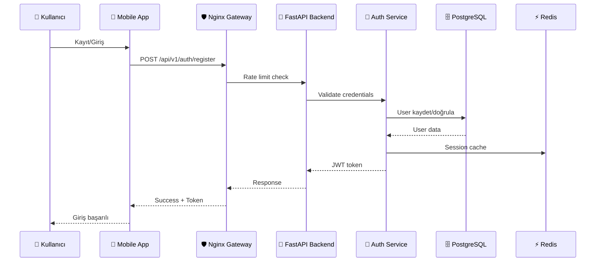
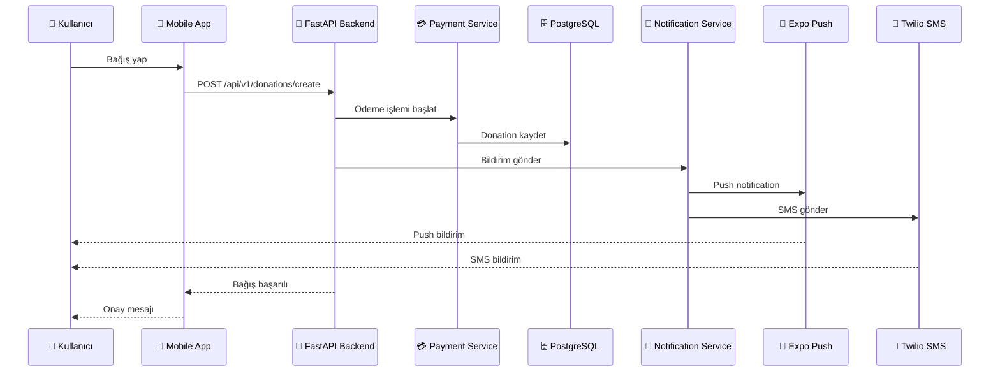
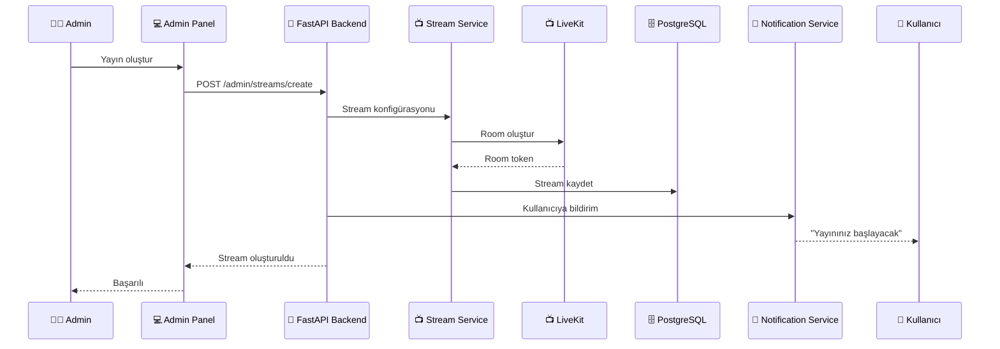

# 🏗️ KurbanCebimde - Modern Sistem Mimarisi

## 📊 Sistem Mimarisi Diagramı

```mermaid
graph TB
    subgraph "🌐 Client Layer"
        MA[Mobile App<br/>📱 React Native + Expo<br/>iOS & Android]
        AP[Admin Panel<br/>💻 React + TypeScript<br/>Web Dashboard]
        WC[Web Client<br/>🌐 React SPA<br/>Public Interface]
    end
    
    subgraph "🔒 Security & Gateway Layer"
        NG[Nginx<br/>🛡️ Reverse Proxy<br/>SSL Termination<br/>Load Balancer]
        RL[Rate Limiting<br/>⚡ Redis Cache<br/>Request Throttling]
        CORS[CORS Policy<br/>🔐 Cross-Origin<br/>Security Headers]
    end
    
    subgraph "⚡ Application Layer"
        BE[FastAPI Backend<br/>🐍 Python 3.11<br/>REST API + WebSocket]
        WS[WebSocket Server<br/>📡 Real-time Updates<br/>Live Notifications]
        BG[Celery Worker<br/>⚙️ Background Tasks<br/>Async Processing]
    end
    
    subgraph "🔧 Service Layer"
        AUTH[Auth Service<br/>🔐 JWT + RBAC<br/>User Management]
        PAY[Payment Service<br/>💳 İyzico/Stripe<br/>Transaction Processing]
        CERT[Certificate Service<br/>📜 PDF Generation<br/>QR Code Validation]
        NOTIF[Notification Service<br/>🔔 Push + SMS + Email<br/>Multi-channel Alerts]
        STREAM[Stream Service<br/>📺 LiveKit Integration<br/>Real-time Streaming]
        FILE[File Service<br/>📁 Media Storage<br/>Local/S3 Storage]
    end
    
    subgraph "💾 Data Layer"
        PG[(PostgreSQL<br/>🗄️ Main Database<br/>ACID Transactions)]
        RD[(Redis<br/>⚡ Cache + Queue<br/>Session Storage)]
        FS[File Storage<br/>📂 Static Files<br/>Certificates & Media]
    end
    
    subgraph "🌍 External Services"
        LIVEKIT[LiveKit<br/>📺 Streaming Platform<br/>Real-time Video]
        TWILIO[Twilio<br/>📱 SMS Service<br/>Global Messaging]
        SMTP[SMTP Server<br/>📧 Email Service<br/>Transactional Emails]
        PAYMENT[Payment Gateways<br/>💳 İyzico/Stripe<br/>Secure Payments]
        EXPO[Expo Push<br/>🔔 Push Notifications<br/>Mobile Alerts]
    end
    
    subgraph "📊 Monitoring & Analytics"
        HEALTH[Health Checks<br/>❤️ System Status<br/>Performance Metrics]
        LOGS[Logging System<br/>📝 Structured Logs<br/>Error Tracking]
        METRICS[Metrics Collection<br/>📈 Performance Data<br/>Usage Analytics]
    end
    
    %% Client connections
    MA --> NG
    AP --> NG
    WC --> NG
    
    %% Gateway processing
    NG --> RL
    RL --> CORS
    CORS --> BE
    
    %% Application layer connections
    BE --> WS
    BE --> BG
    BE --> AUTH
    BE --> PAY
    BE --> CERT
    BE --> NOTIF
    BE --> STREAM
    BE --> FILE
    
    %% Data layer connections
    AUTH --> PG
    PAY --> PG
    CERT --> PG
    NOTIF --> PG
    STREAM --> PG
    FILE --> PG
    
    BG --> RD
    BE --> RD
    RL --> RD
    
    %% External service connections
    NOTIF --> TWILIO
    NOTIF --> SMTP
    NOTIF --> EXPO
    PAY --> PAYMENT
    STREAM --> LIVEKIT
    
    %% Monitoring connections
    BE --> HEALTH
    BE --> LOGS
    BE --> METRICS
    
    %% Styling
    classDef clientLayer fill:#e1f5fe,stroke:#01579b,stroke-width:2px
    classDef securityLayer fill:#fff3e0,stroke:#e65100,stroke-width:2px
    classDef appLayer fill:#f3e5f5,stroke:#4a148c,stroke-width:2px
    classDef serviceLayer fill:#e8f5e8,stroke:#1b5e20,stroke-width:2px
    classDef dataLayer fill:#fce4ec,stroke:#880e4f,stroke-width:2px
    classDef externalLayer fill:#fff8e1,stroke:#f57f17,stroke-width:2px
    classDef monitoringLayer fill:#f1f8e9,stroke:#33691e,stroke-width:2px
    
    class MA,AP,WC clientLayer
    class NG,RL,CORS securityLayer
    class BE,WS,BG appLayer
    class AUTH,PAY,CERT,NOTIF,STREAM,FILE serviceLayer
    class PG,RD,FS dataLayer
    class LIVEKIT,TWILIO,SMTP,PAYMENT,EXPO externalLayer
    class HEALTH,LOGS,METRICS monitoringLayer
```



## 🔄 Veri Akışı ve İşlem Süreçleri

### 1. **Kullanıcı Kayıt ve Kimlik Doğrulama**



### 2. **Bağış İşlemi ve Ödeme**



### 3. **Canlı Yayın Süreci**



## 🏛️ Teknoloji Stack Detayları

### **Frontend Technologies**
- **React Native + Expo**: Cross-platform mobil uygulama
- **React + TypeScript**: Modern web admin paneli
- **Vite**: Hızlı build tool ve development server
- **Zustand**: Hafif state management
- **React Navigation**: Mobil navigasyon sistemi

### **Backend Technologies**
- **FastAPI**: Modern, hızlı Python web framework
- **PostgreSQL**: Güçlü relational database
- **Redis**: Yüksek performanslı cache ve queue
- **SQLAlchemy**: Python ORM
- **Alembic**: Database migration tool
- **Celery**: Distributed task queue
- **Uvicorn**: ASGI server

### **Infrastructure & DevOps**
- **Docker**: Containerization
- **Docker Compose**: Multi-container orchestration
- **Nginx**: Reverse proxy ve load balancer
- **SSL/TLS**: Güvenli iletişim
- **Let's Encrypt**: Otomatik SSL sertifikası

### **External Services**
- **LiveKit**: Real-time video streaming
- **Twilio**: Global SMS service
- **İyzico/Stripe**: Payment processing
- **Expo Push**: Mobile push notifications
- **SMTP**: Email service

## 🔐 Güvenlik Katmanları

### **1. Network Security**
- **SSL/TLS Encryption**: Tüm iletişim şifrelenir
- **CORS Policy**: Cross-origin güvenlik
- **Rate Limiting**: DDoS koruması
- **Request Validation**: Input sanitization

### **2. Authentication & Authorization**
- **JWT Tokens**: Stateless authentication
- **Role-Based Access Control**: Admin/User rolleri
- **Password Hashing**: bcrypt ile güvenli şifreleme
- **Session Management**: Redis tabanlı session

### **3. Data Protection**
- **Database Encryption**: At-rest encryption
- **Environment Variables**: Hassas veri koruması
- **Audit Logging**: Kullanıcı aktivite takibi
- **Input Validation**: Pydantic schemas

## 📊 Monitoring ve Analytics

### **Health Monitoring**
- **System Health Checks**: `/health` endpoint
- **Database Connectivity**: Connection monitoring
- **Service Status**: Individual service health
- **Performance Metrics**: Response time tracking

### **Logging Strategy**
- **Structured Logging**: JSON format
- **Log Levels**: DEBUG, INFO, WARNING, ERROR
- **Request Tracking**: Unique request IDs
- **Error Tracking**: Comprehensive error logging

### **Analytics**
- **User Activity**: Kullanıcı davranış analizi
- **Performance Metrics**: API response times
- **Error Rates**: Hata oranı takibi
- **Usage Statistics**: Platform kullanım istatistikleri

## 🚀 Deployment Architecture

### **Development Environment**
```bash
# Local development stack
docker-compose up -d

# Services:
# - Backend API: http://localhost:8000
# - Admin Panel: http://localhost:3000
# - Mobile App: Expo development server
# - PostgreSQL: localhost:5432
# - Redis: localhost:6380
# - Nginx: localhost:80/443
```

### **Production Environment**
- **Container Orchestration**: Docker Compose
- **Reverse Proxy**: Nginx with SSL
- **Database**: PostgreSQL with automated backups
- **Caching**: Redis cluster
- **Monitoring**: Health checks and alerts
- **CDN**: Static file delivery

## 🔄 Domain Configuration

> **Önemli Not**: Sistem localhost yerine domain tabanlı çalışacak şekilde yapılandırılmıştır.

### **Domain Structure**
- **API Domain**: `api.kurbancebimde.com`
- **Admin Panel**: `admin.kurbancebimde.com`
- **Web Client**: `www.kurbancebimde.com`
- **Mobile API**: `mobile.kurbancebimde.com`

### **SSL Configuration**
- **Let's Encrypt**: Otomatik SSL sertifikası
- **Wildcard Certificates**: Subdomain desteği
- **HTTP/2**: Modern protokol desteği
- **Security Headers**: Güvenlik başlıkları

## 📡 API Endpoints Detayları

### **🔐 Authentication Endpoints**
```bash
# Kullanıcı Kayıt/Giriş
POST /api/v1/auth/register
POST /api/v1/auth/login
POST /api/v1/auth/refresh
GET  /api/v1/auth/me
POST /api/v1/auth/logout

# Admin Authentication
POST /api/v1/admin/auth/login
GET  /api/v1/admin/auth/me
POST /api/v1/admin/auth/refresh
```

### **👥 User Management**
```bash
# Kullanıcı İşlemleri
GET    /api/v1/users/profile
PUT    /api/v1/users/profile
GET    /api/v1/users/donations
GET    /api/v1/users/certificates
GET    /api/v1/users/streams

# Admin User Management
GET    /api/v1/admin/users
GET    /api/v1/admin/users/{user_id}
PUT    /api/v1/admin/users/{user_id}
DELETE /api/v1/admin/users/{user_id}
POST   /api/v1/admin/users/{user_id}/activate
POST   /api/v1/admin/users/{user_id}/deactivate
```

### **💰 Donation Management**
```bash
# Bağış İşlemleri
POST   /api/v1/donations/create
GET    /api/v1/donations/my-donations
GET    /api/v1/donations/{donation_id}
POST   /api/v1/donations/{donation_id}/payment
GET    /api/v1/donations/{donation_id}/certificate

# Admin Donation Management
GET    /api/v1/admin/donations
GET    /api/v1/admin/donations/{donation_id}
PUT    /api/v1/admin/donations/{donation_id}/status
GET    /api/v1/admin/donations/stats
GET    /api/v1/admin/donations/export
```

### **📺 Stream Management**
```bash
# Yayın İşlemleri
GET    /api/v1/streams
GET    /api/v1/streams/{stream_id}
GET    /api/v1/streams/{stream_id}/token
POST   /api/v1/streams/{stream_id}/join
POST   /api/v1/streams/{stream_id}/leave

# Admin Stream Management
POST   /api/v1/admin/streams/create
GET    /api/v1/admin/streams
PUT    /api/v1/admin/streams/{stream_id}
DELETE /api/v1/admin/streams/{stream_id}
POST   /api/v1/admin/streams/{stream_id}/start
POST   /api/v1/admin/streams/{stream_id}/stop
GET    /api/v1/admin/streams/{stream_id}/participants
```

### **📜 Certificate Management**
```bash
# Sertifika İşlemleri
GET    /api/v1/certificates/my-certificates
GET    /api/v1/certificates/{certificate_id}
GET    /api/v1/certificates/{certificate_id}/download
GET    /api/v1/certificates/verify/{verification_code}

# Admin Certificate Management
GET    /api/v1/admin/certificates
POST   /api/v1/admin/certificates/generate
GET    /api/v1/admin/certificates/stats
GET    /api/v1/admin/certificates/export
```

### **🔔 Notification Management**
```bash
# Bildirim İşlemleri
POST   /api/v1/notifications/send
POST   /api/v1/notifications/send-bulk
POST   /api/v1/notifications/kurban
POST   /api/v1/notifications/donation
POST   /api/v1/notifications/stream
GET    /api/v1/notifications/history
```

---

## 🎯 Sonuç

Bu modern sistem mimarisi, KurbanCebimde platformunun:

✅ **Ölçeklenebilir**: Horizontal scaling desteği  
✅ **Güvenli**: Multi-layer security  
✅ **Performanslı**: Optimized caching ve database  
✅ **Monitoring**: Comprehensive logging ve metrics  
✅ **Production-Ready**: Domain tabanlı deployment  

şekilde çalışmasını sağlar. Sistem artık production ortamında güvenle kullanılabilir! 🚀
