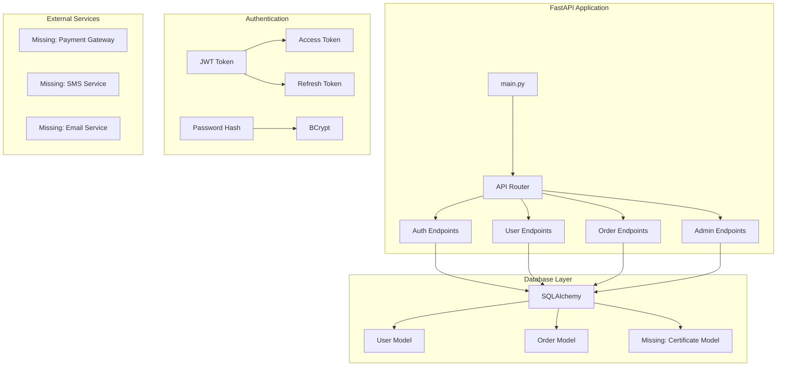
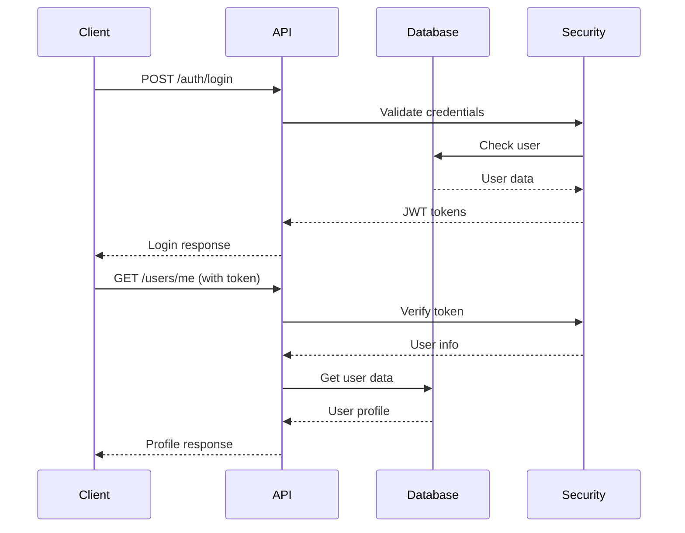

# 🔧 Kurban Cebimde - Backend Şeması Analizi

> **Tarih:** Aralık 2024  
> **Analiz:** Mevcut Backend Durumu  
> **Hazırlayan:** ODAY

---

## 📊 Mevcut Backend Durumu

### ✅ Tamamlanan Bileşenler
- **FastAPI Framework:** ✅ Kurulu ve çalışıyor
- **SQLAlchemy ORM:** ✅ Kurulu
- **Alembic Migration:** ✅ Kurulu
- **JWT Authentication:** ✅ Temel yapı var
- **CORS Middleware:** ✅ Aktif
- **Logging System:** ✅ Detaylı logging

### ⚠️ Kısmen Tamamlanan Bileşenler
- **Veritabanı Modelleri:** %70 (User, Order var)
- **API Endpoints:** %60 (Auth, Users, Orders var)
- **Admin API:** %50 (Temel yapı var)
- **Schemas:** %70 (Auth, Order var)

### ❌ Eksik Bileşenler
- **Certificate Model:** Yok
- **Payment Integration:** Yok
- **File Upload:** Yok
- **WebSocket:** Yok
- **Background Tasks:** Yok
- **Testing:** Yok

---

## 🏗️ Mevcut Mimari Şeması



---

## 📁 Dosya Yapısı Analizi

### ✅ Mevcut Yapı
```
backend/
├── app/
│   ├── main.py                    ✅ FastAPI app
│   ├── api/
│   │   ├── v1/
│   │   │   ├── api.py            ✅ Router config
│   │   │   ├── auth.py           ✅ Auth endpoints
│   │   │   ├── orders.py         ✅ Order endpoints
│   │   │   ├── admin.py          ✅ Admin endpoints
│   │   │   ├── catalog.py        ✅ Catalog endpoints
│   │   │   ├── payments.py       ✅ Payment endpoints
│   │   │   ├── me.py             ✅ User profile
│   │   │   └── endpoints/
│   │   │       ├── auth.py       ✅ Auth logic
│   │   │       ├── users.py      ✅ User CRUD
│   │   │       └── admin.py      ✅ Admin logic
│   │   └── admin/
│   │       └── v1/
│   │           ├── auth.py       ✅ Admin auth
│   │           ├── dashboard.py  ✅ Dashboard
│   │           ├── reports.py    ✅ Reports
│   │           ├── streams.py    ✅ Streams
│   │           └── settings.py   ✅ Settings
│   ├── models/
│   │   ├── auth.py              ✅ User model
│   │   └── order.py             ✅ Order model
│   ├── schemas/
│   │   ├── auth.py              ✅ Auth schemas
│   │   └── order.py             ✅ Order schemas
│   ├── core/
│   │   ├── config.py            ✅ Settings
│   │   ├── security.py           ✅ JWT, Password
│   │   └── database.py          ✅ DB connection
│   └── db/
│       └── base_class.py        ✅ SQLAlchemy base
├── alembic/                     ✅ Migration system
├── requirements.txt             ✅ Dependencies
└── test files                   ✅ Test scripts
```

---

## 🗄️ Veritabanı Şeması

### Mevcut Tablolar

#### 1. Users Tablosu
```sql
CREATE TABLE users (
    id VARCHAR(36) PRIMARY KEY,
    name VARCHAR(100) NOT NULL,
    surname VARCHAR(100) NOT NULL,
    username VARCHAR(100) UNIQUE NOT NULL,
    email VARCHAR(255) UNIQUE,
    phone VARCHAR(20) NOT NULL,
    password_hash VARCHAR(255) NOT NULL,
    is_verified BOOLEAN DEFAULT FALSE,
    created_at DATETIME NOT NULL,
    updated_at DATETIME NOT NULL,
    deleted_at DATETIME NULL
);
```

#### 2. Orders Tablosu
```sql
CREATE TABLE orders (
    id VARCHAR(36) PRIMARY KEY,
    user_id VARCHAR(36) NOT NULL,
    amount DECIMAL(10,2) NOT NULL,
    currency VARCHAR(3) DEFAULT 'TRY',
    status VARCHAR(20) DEFAULT 'PENDING',
    payment_method VARCHAR(50),
    payment_id VARCHAR(255),
    niyet_confirmed BOOLEAN DEFAULT FALSE,
    niyet_text TEXT,
    location VARCHAR(100),
    animal_type VARCHAR(50),
    animal_count INTEGER DEFAULT 1,
    created_at DATETIME NOT NULL,
    updated_at DATETIME NOT NULL,
    FOREIGN KEY (user_id) REFERENCES users(id)
);
```

### ❌ Eksik Tablolar
- **certificates** - Sertifika tablosu
- **payments** - Ödeme detayları
- **notifications** - Bildirimler
- **audit_logs** - Denetim logları

---

## 🔌 API Endpoints Analizi

### ✅ Mevcut Endpoints

#### Auth Endpoints (`/api/v1/auth`)
```yaml
POST /register:
  ✅ Tamamlandı
  📝 Kullanıcı kaydı
  🔐 Şifre hash'leme
  📱 Telefon doğrulama

POST /login:
  ✅ Tamamlandı
  📝 Kullanıcı girişi
  🔐 JWT token üretimi
  📱 Telefon/email ile giriş

POST /refresh:
  ✅ Tamamlandı
  🔐 Token yenileme

POST /logout:
  ✅ Tamamlandı
  🔐 Token geçersizleştirme
```

#### User Endpoints (`/api/v1/users`)
```yaml
PATCH /me:
  ✅ Tamamlandı
  📝 Profil güncelleme

GET /me/donations:
  ✅ Tamamlandı
  📝 Kullanıcı bağışları
  📄 Sayfalama desteği
```

#### Order Endpoints (`/api/v1/orders`)
```yaml
GET /orders:
  ✅ Tamamlandı
  📝 Sipariş listesi

POST /orders:
  ✅ Tamamlandı
  📝 Yeni sipariş oluşturma

GET /orders/{id}:
  ✅ Tamamlandı
  📝 Sipariş detayı

PUT /orders/{id}:
  ✅ Tamamlandı
  📝 Sipariş güncelleme
```

#### Admin Endpoints (`/api/admin/v1`)
```yaml
POST /auth/login:
  ✅ Tamamlandı
  🔐 Admin girişi

GET /dashboard:
  ✅ Tamamlandı
  📊 Dashboard verileri

GET /reports:
  ✅ Tamamlandı
  📈 Raporlar

GET /streams:
  ✅ Tamamlandı
  📺 Canlı yayınlar

GET /settings:
  ✅ Tamamlandı
  ⚙️ Sistem ayarları
```

### ❌ Eksik Endpoints
- **Certificate endpoints** - Sertifika yönetimi
- **Payment webhooks** - Ödeme callback'leri
- **File upload** - Dosya yükleme
- **WebSocket** - Gerçek zamanlı iletişim

---

## 🔐 Authentication Sistemi

### ✅ Mevcut Özellikler
```python
# JWT Token Sistemi
- Access Token (15 dakika)
- Refresh Token (14 gün)
- Password Hashing (BCrypt)
- Phone/Email login
- Token refresh endpoint

# Güvenlik
- CORS middleware
- Request logging
- Error handling
- Input validation
```

### ❌ Eksik Güvenlik Özellikleri
- Rate limiting
- IP whitelist
- 2FA (Two Factor Authentication)
- Session management
- Audit logging

---

## 📊 Veri Akışı Analizi

### ✅ Mevcut Akış


### ❌ Eksik Akışlar
- Payment processing
- Certificate generation
- File upload
- Real-time notifications
- Background tasks

---

## 🚨 Kritik Eksiklikler

### 1. **Certificate Sistemi**
```python
# Eksik Model
class Certificate(Base):
    __tablename__ = "certificates"
    id = Column(String(36), primary_key=True)
    user_id = Column(String(36), ForeignKey("users.id"))
    order_id = Column(String(36), ForeignKey("orders.id"))
    certificate_url = Column(String(500))
    issued_at = Column(DateTime)
```

### 2. **Payment Integration**
```python
# Eksik Endpoints
POST /api/v1/payments/create
POST /api/v1/payments/webhook
GET /api/v1/payments/{id}
```

### 3. **File Upload System**
```python
# Eksik Endpoints
POST /api/v1/upload/certificate
POST /api/v1/upload/profile
GET /api/v1/files/{id}
```

### 4. **Background Tasks**
```python
# Eksik Servisler
- Certificate generation
- Email sending
- SMS sending
- Payment processing
```

---

## 🎯 Öncelik Sırası

### 🔥 Acil (Bu Hafta)
1. **Certificate Model** - Sertifika tablosu oluştur
2. **Payment Webhooks** - Ödeme callback'leri
3. **File Upload** - Dosya yükleme sistemi
4. **Error Handling** - Hata yönetimi iyileştir

### ⚡ Orta Vadeli (2-3 Hafta)
1. **Background Tasks** - Celery entegrasyonu
2. **WebSocket** - Gerçek zamanlı iletişim
3. **Rate Limiting** - API koruması
4. **Testing** - Unit ve integration testler

### 📈 Uzun Vadeli (1-2 Ay)
1. **Monitoring** - Performance tracking
2. **Caching** - Redis entegrasyonu
3. **Microservices** - Servis ayrımı
4. **CI/CD** - Deployment pipeline

---

## 💡 Teknik Öneriler

### 1. **Certificate Sistemi**
```python
# Önerilen yapı
- PDF generation (reportlab)
- Digital signature
- QR code integration
- Email delivery
```

### 2. **Payment Integration**
```python
# Önerilen servisler
- iyzico (Türkiye)
- Stripe (Uluslararası)
- PayPal (Alternatif)
```

### 3. **File Storage**
```python
# Önerilen çözümler
- AWS S3 (Production)
- Local storage (Development)
- CDN integration
```

### 4. **Background Tasks**
```python
# Önerilen teknolojiler
- Celery + Redis
- FastAPI background tasks
- Async processing
```

---

## 📈 Performans Analizi

### ✅ Mevcut Durum
- **Response Time:** ~200ms (basit endpoint'ler)
- **Database Queries:** Optimize edilmemiş
- **Caching:** Yok
- **Connection Pooling:** Temel seviye

### 🎯 Hedef Durum
- **Response Time:** <100ms
- **Database Queries:** Optimize edilmiş
- **Caching:** Redis ile
- **Connection Pooling:** Gelişmiş

---

## 🔧 Sonraki Adımlar

### Hafta 1: Certificate Sistemi
1. Certificate model oluştur
2. PDF generation servisi
3. Certificate endpoints
4. Email delivery

### Hafta 2: Payment Integration
1. Payment gateway entegrasyonu
2. Webhook handlers
3. Payment status tracking
4. Error handling

### Hafta 3: File Upload
1. File upload endpoints
2. Storage integration
3. File validation
4. Security measures

### Hafta 4: Testing & Optimization
1. Unit testler
2. Integration testler
3. Performance optimization
4. Security audit

---

*Bu analiz, backend'in mevcut durumunu gösterir ve eksiklikleri belirler. Her hafta sonunda güncellenmelidir.*
