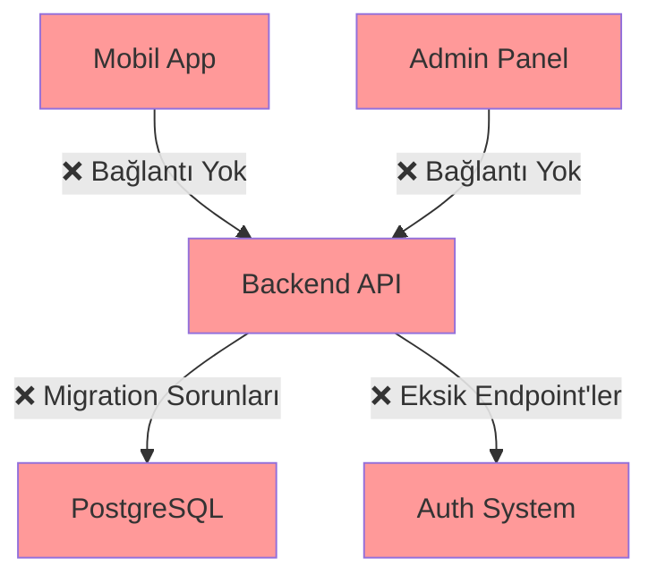
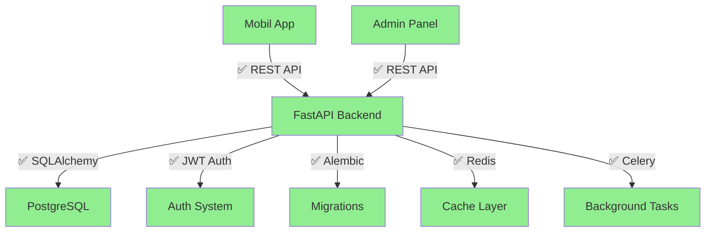

# 🧠 Kurban Cebimde - Beyin Fırtınası & Çözüm Planı

> **Tarih:** Aralık 2024  
> **Hazırlayan:** ODAY  
> **Referans:** PROJE_DURUMU.md (Aralık 2024)

---

## 🎯 1. Proje Özeti & Durum Analizi

### 📊 Mevcut Durum
- **Mobil UI:** %95 ✅ (16/16 ekran tamam)
- **Admin UI:** %90 ✅ (13/13 sayfa tamam)
- **Backend API:** %30 ❌ (Kritik eksiklik)
- **Veritabanı:** %40 ❌ (Migration sorunları)
- **Entegrasyon:** %10 ❌ (Bağlantı yok)
- **Test:** %0 ❌ (Hiç yok)
- **Deployment:** %0 ❌ (Hiç yok)

### 🎯 Genel İlerleme: %45

---

## 🏗️ 2. Mimari Analizi & Öneriler

### Mevcut Mimari Sorunları


### Önerilen Mimari


---

## 🔍 3. Kök Neden Analizi (5 Whys)

### Sorun 1: Backend API Eksiklikleri
| Soru | Cevap | Aksiyon |
|------|-------|---------|
| **Neden API'ler eksik?** | UI öncelikli yaklaşım | Backend'e öncelik ver |
| **Neden UI öncelikli?** | Hızlı görsel ilerleme | API-first yaklaşıma geç |
| **Neden API-first değil?** | Planlama eksikliği | Sprint planlaması yap |
| **Neden planlama eksik?** | Teknik liderlik yok | Tech lead ataması |
| **Neden tech lead yok?** | Proje yönetimi eksik | Proje yönetimi kur |

### Sorun 2: Veritabanı Migration Sorunları
| Soru | Cevap | Aksiyon |
|------|-------|---------|
| **Neden migration'lar eksik?** | Model değişiklikleri hızlı | Migration disiplini kur |
| **Neden hızlı değişiklik?** | Gereksinim belirsizliği | Requirements freeze |
| **Neden belirsizlik?** | Stakeholder iletişimi eksik | Düzenli toplantılar |
| **Neden iletişim eksik?** | Proje yönetimi yok | PM ataması |
| **Neden PM yok?** | Organizasyon eksikliği | Organizasyon yapısı |

---

## 🚀 4. Somut Çözüm Önerileri

### 🔥 Acil Aksiyonlar (Bu Hafta)

#### 1. Backend API Tamamlama
```python
# Öncelik Sırası:
1. User CRUD API'leri (/api/v1/users/*)
2. Authentication endpoints (/api/v1/auth/*)
3. Order management (/api/v1/orders/*)
4. Admin API'leri (/api/admin/v1/*)
5. Certificate endpoints (/api/v1/certificates/*)
```

#### 2. Veritabanı Düzeltme
```bash
# Migration Sırası:
1. Alembic revision --autogenerate
2. Alembic upgrade head
3. Test verileri ekle
4. Bağlantı testleri
```

#### 3. API Client'ları
```typescript
// Mobil için API Client
// src/lib/api.js
export const apiClient = {
  auth: { login, register, refresh },
  users: { getProfile, updateProfile },
  orders: { create, list, get },
  certificates: { list, download }
}

// Admin için API Client  
// admin-panel/src/lib/adminApi.ts
export const adminApi = {
  auth: { login, logout },
  users: { list, create, update, delete },
  orders: { list, update, delete },
  reports: { generate, export }
}
```

### ⚡ Orta Vadeli (2-4 Hafta)

#### 4. Entegrasyon Testleri
```javascript
// Test Stratejisi:
1. Unit Tests (Jest + React Testing Library)
2. Integration Tests (API endpoints)
3. E2E Tests (Cypress/Playwright)
4. Mobile Tests (Detox)
```

#### 5. Güvenlik Implementasyonu
```python
# Güvenlik Katmanları:
1. Input validation (Pydantic)
2. Rate limiting (Redis)
3. CORS configuration
4. Security headers
5. SQL injection protection
```

### 📈 Uzun Vadeli (1-2 Ay)

#### 6. Monitoring & Analytics
```yaml
# Monitoring Stack:
- Error Tracking: Sentry
- Performance: New Relic
- Logs: ELK Stack
- Metrics: Prometheus + Grafana
- Uptime: UptimeRobot
```

---

## 🎯 5. Sprint Planlaması

### Sprint 1 (Hafta 1-2): Backend Foundation
- [ ] User model ve API'leri
- [ ] Authentication sistemi
- [ ] Database migration'ları
- [ ] Basic CRUD operations

### Sprint 2 (Hafta 3-4): API Completion
- [ ] Order management API
- [ ] Certificate API
- [ ] Admin API'leri
- [ ] API documentation

### Sprint 3 (Hafta 5-6): Integration
- [ ] Mobil ↔ Backend entegrasyonu
- [ ] Admin ↔ Backend entegrasyonu
- [ ] Error handling
- [ ] Loading states

### Sprint 4 (Hafta 7-8): Testing & Security
- [ ] Unit testler
- [ ] Integration testler
- [ ] Security hardening
- [ ] Performance optimization

### Sprint 5 (Hafta 9-10): Deployment
- [ ] Docker containerization
- [ ] CI/CD pipeline
- [ ] Production deployment
- [ ] SSL sertifikası

---

## 📊 6. Başarı Metrikleri

### Teknik Metrikler
| Metrik | Hedef | Ölçüm |
|--------|-------|-------|
| API Response Time | <300ms | p95 latency |
| Error Rate | <1% | HTTP 5xx rate |
| Test Coverage | >80% | Jest coverage |
| Uptime | >99.9% | Availability |

### İş Metrikleri
| Metrik | Hedef | Ölçüm |
|--------|-------|-------|
| User Registration | >1000 | Monthly signups |
| Order Completion | >98% | Success rate |
| Payment Success | >99% | Transaction rate |
| User Retention | >70% | 30-day retention |

---

## 🛠️ 7. Teknik Detaylar

### Backend API Endpoints (Önerilen)
```yaml
# Kullanıcı API'leri (/api/v1)
/users:
  - GET /profile
  - PUT /profile
  - POST /register
  - POST /login
  - POST /logout
  - POST /refresh

/orders:
  - GET /orders
  - POST /orders
  - GET /orders/{id}
  - PUT /orders/{id}
  - DELETE /orders/{id}

/certificates:
  - GET /certificates
  - GET /certificates/{id}
  - POST /certificates/download

# Admin API'leri (/api/admin/v1)
/admin/users:
  - GET /users
  - POST /users
  - PUT /users/{id}
  - DELETE /users/{id}

/admin/orders:
  - GET /orders
  - PUT /orders/{id}
  - DELETE /orders/{id}

/admin/reports:
  - GET /reports
  - POST /reports/generate
```

### Veritabanı Şeması (Önerilen)
```sql
-- Users tablosu
CREATE TABLE users (
    id UUID PRIMARY KEY DEFAULT gen_random_uuid(),
    email VARCHAR(255) UNIQUE NOT NULL,
    password_hash VARCHAR(255) NOT NULL,
    first_name VARCHAR(100),
    last_name VARCHAR(100),
    phone VARCHAR(20),
    role VARCHAR(20) DEFAULT 'user',
    is_active BOOLEAN DEFAULT true,
    created_at TIMESTAMP DEFAULT NOW(),
    updated_at TIMESTAMP DEFAULT NOW()
);

-- Orders tablosu
CREATE TABLE orders (
    id UUID PRIMARY KEY DEFAULT gen_random_uuid(),
    user_id UUID REFERENCES users(id),
    animal_type VARCHAR(50) NOT NULL,
    quantity INTEGER DEFAULT 1,
    amount DECIMAL(10,2) NOT NULL,
    status VARCHAR(20) DEFAULT 'pending',
    payment_status VARCHAR(20) DEFAULT 'pending',
    created_at TIMESTAMP DEFAULT NOW(),
    updated_at TIMESTAMP DEFAULT NOW()
);

-- Certificates tablosu
CREATE TABLE certificates (
    id UUID PRIMARY KEY DEFAULT gen_random_uuid(),
    user_id UUID REFERENCES users(id),
    order_id UUID REFERENCES orders(id),
    certificate_url VARCHAR(500),
    issued_at TIMESTAMP DEFAULT NOW()
);
```

---

## 🎯 8. Risk Analizi

### Yüksek Risk
| Risk | Olasılık | Etki | Azaltma Stratejisi |
|------|----------|------|-------------------|
| Backend API gecikmesi | Yüksek | Kritik | Sprint 1'e odaklan |
| Veritabanı migration sorunları | Orta | Yüksek | Test environment kur |
| Entegrasyon sorunları | Yüksek | Orta | API-first yaklaşım |

### Orta Risk
| Risk | Olasılık | Etki | Azaltma Stratejisi |
|------|----------|------|-------------------|
| Test coverage eksikliği | Orta | Orta | TDD yaklaşımı |
| Performance sorunları | Düşük | Orta | Monitoring kur |
| Security vulnerabilities | Düşük | Yüksek | Security audit |

---

## 📋 9. Aksiyon Planı

### Bu Hafta Yapılacaklar
1. **Backend API'lerini başlat**
   - User model'ini tamamla
   - Authentication endpoint'lerini yaz
   - Basic CRUD operations

2. **Veritabanı migration'larını çalıştır**
   - Alembic revision oluştur
   - Test verileri ekle
   - Bağlantı testleri yap

3. **API client'larını hazırla**
   - Mobil için API client
   - Admin için API client
   - Error handling ekle

### Gelecek Hafta Yapılacaklar
1. **Entegrasyon testleri**
2. **Security hardening**
3. **Performance optimization**

---

## 🎉 10. Sonuç & Öneriler

### Ana Öneriler
1. **API-first yaklaşıma geç** - Backend'e öncelik ver
2. **Sprint planlaması yap** - Düzenli hedefler belirle
3. **Test-driven development** - Kaliteyi artır
4. **Monitoring kur** - Proaktif sorun çözümü

### Başarı Faktörleri
- Backend API'lerinin tamamlanması
- Veritabanı migration'larının düzeltilmesi
- Mobil ve admin panel entegrasyonu
- Test coverage'ının artırılması

### Tahmini Tamamlanma
- **Backend API:** 2-3 hafta
- **Entegrasyon:** 1-2 hafta
- **Testing:** 1-2 hafta
- **Deployment:** 1 hafta

**Toplam:** 5-8 hafta

---

*Bu beyin fırtınası dokümanı, projenin mevcut durumunu analiz eder ve somut çözüm önerileri sunar. Düzenli olarak güncellenmelidir.*
