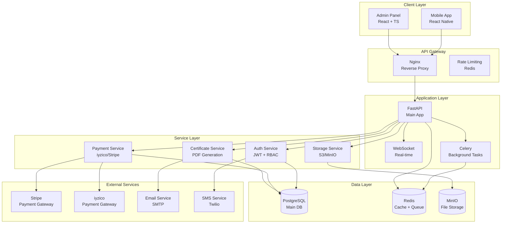

# 🚀 Kurban Cebimde - Implementasyon Planı

> **Tarih:** Aralık 2024  
> **Temel:** Beyin Fırtınası Analizi  
> **Hedef:** Tam Fonksiyonel Sistem

---

## 🎯 Proje Durumu Özeti

### 📊 Mevcut Durum
- **Mobil UI:** %95 ✅ (16/16 ekran)
- **Admin UI:** %90 ✅ (13/13 sayfa)
- **Backend API:** %60 ✅ (Auth, Users, Orders var)
- **Veritabanı:** %70 ✅ (User, Order tabloları)
- **Entegrasyon:** %10 ❌ (Kritik eksiklik)

### 🚨 Kritik Eksiklikler
1. **Certificate Sistemi** - Sertifika oluşturma ve yönetimi
2. **Payment Integration** - Ödeme sistemi ve webhook'lar
3. **File Upload** - Dosya yükleme sistemi
4. **Background Tasks** - Arka plan işleri
5. **Entegrasyon** - Mobil ↔ Backend bağlantısı

---

## 🏗️ Mimari Şeması



---

## 📋 Sprint Planlaması

### 🚀 Sprint 1: Certificate Sistemi (1 Hafta)

#### Hedefler
- [ ] Certificate model oluştur
- [ ] PDF generation servisi
- [ ] Certificate endpoints
- [ ] Email delivery sistemi

#### Görevler
```yaml
Day 1-2: Model & Schema
- Certificate model (SQLAlchemy)
- Certificate schema (Pydantic)
- Alembic migration
- Test verileri

Day 3-4: PDF Service
- PDF generation (reportlab)
- Template system
- QR code integration
- Digital signature

Day 5-6: API Endpoints
- POST /certificates/{order_id}
- GET /certificates/{id}
- GET /me/certificates
- GET /certificates/{id}/download

Day 7: Email Integration
- Email service setup
- Certificate delivery
- Error handling
- Testing
```

#### Teknik Detaylar
```python
# Certificate Model
class Certificate(Base):
    __tablename__ = "certificates"
    id = Column(String(36), primary_key=True)
    user_id = Column(String(36), ForeignKey("users.id"))
    order_id = Column(String(36), ForeignKey("orders.id"))
    file_key = Column(String(500))  # S3/MinIO key
    status = Column(Enum(CertStatus))
    issued_at = Column(DateTime)
    expires_at = Column(DateTime)

# PDF Generation Service
class CertificateService:
    def generate_pdf(self, order_id: str) -> bytes:
        # 1. Order ve User bilgilerini çek
        # 2. PDF template'i render et
        # 3. QR code ekle
        # 4. Digital signature ekle
        # 5. Bytes olarak döndür
```

### 💳 Sprint 2: Payment Integration (1 Hafta)

#### Hedefler
- [ ] Payment gateway entegrasyonu
- [ ] Webhook handlers
- [ ] Payment status tracking
- [ ] Error handling

#### Görevler
```yaml
Day 1-2: Payment Models
- Payment model
- Payment schema
- Payment status enum
- Alembic migration

Day 3-4: Gateway Integration
- iyzico entegrasyonu
- Stripe entegrasyonu
- Payment intent creation
- Payment validation

Day 5-6: Webhook System
- Webhook endpoints
- Signature verification
- Payment status update
- Order status sync

Day 7: Error Handling
- Payment error handling
- Retry mechanism
- Logging system
- Testing
```

#### Teknik Detaylar
```python
# Payment Model
class Payment(Base):
    __tablename__ = "payments"
    id = Column(String(36), primary_key=True)
    order_id = Column(String(36), ForeignKey("orders.id"))
    amount = Column(Decimal(10,2))
    currency = Column(String(3))
    provider = Column(String(20))  # stripe, iyzico
    provider_payment_id = Column(String(255))
    status = Column(Enum(PaymentStatus))
    created_at = Column(DateTime)

# Webhook Handler
@router.post("/webhooks/iyzico")
async def iyzico_webhook(request: Request):
    # 1. Signature verification
    # 2. Payment status check
    # 3. Order status update
    # 4. Certificate generation trigger
```

### 📁 Sprint 3: File Upload System (1 Hafta)

#### Hedefler
- [ ] File upload endpoints
- [ ] Storage integration
- [ ] File validation
- [ ] Security measures

#### Görevler
```yaml
Day 1-2: Storage Setup
- MinIO/S3 configuration
- File upload service
- Presigned URL generation
- File validation

Day 3-4: Upload Endpoints
- POST /files/upload
- POST /files/presign-upload
- GET /files/{id}
- DELETE /files/{id}

Day 5-6: Security & Validation
- File type validation
- File size limits
- Virus scanning
- Access control

Day 7: Integration
- Certificate file upload
- Profile picture upload
- Error handling
- Testing
```

#### Teknik Detaylar
```python
# File Upload Service
class FileService:
    def presign_upload(self, key: str, content_type: str) -> str:
        return s3.generate_presigned_url(
            ClientMethod="put_object",
            Params={"Bucket": settings.S3_BUCKET, "Key": key},
            ExpiresIn=600
        )
    
    def upload_file(self, file: UploadFile, folder: str) -> str:
        # 1. File validation
        # 2. Generate unique key
        # 3. Upload to S3/MinIO
        # 4. Return file key
```

### ⚡ Sprint 4: Background Tasks (1 Hafta)

#### Hedefler
- [ ] Celery setup
- [ ] Background task system
- [ ] Task monitoring
- [ ] Error handling

#### Görevler
```yaml
Day 1-2: Celery Setup
- Celery configuration
- Redis setup
- Task queue system
- Worker processes

Day 3-4: Task Implementation
- Certificate generation task
- Email sending task
- SMS sending task
- Payment processing task

Day 5-6: Monitoring
- Task monitoring
- Error tracking
- Retry mechanism
- Logging system

Day 7: Integration
- Task triggers
- Error handling
- Performance optimization
- Testing
```

#### Teknik Detaylar
```python
# Celery Configuration
celery = Celery(
    "kurban_cebimde",
    broker=settings.REDIS_URL,
    backend=settings.REDIS_URL
)

# Background Tasks
@celery.task
def generate_certificate_task(order_id: str):
    # 1. Get order data
    # 2. Generate PDF
    # 3. Upload to storage
    # 4. Update certificate record
    # 5. Send email

@celery.task
def send_email_task(to_email: str, subject: str, content: str):
    # Email sending logic
```

### 🔗 Sprint 5: Integration & Testing (1 Hafta)

#### Hedefler
- [ ] Mobil ↔ Backend entegrasyonu
- [ ] Admin ↔ Backend entegrasyonu
- [ ] API client'ları
- [ ] End-to-end testing

#### Görevler
```yaml
Day 1-2: API Clients
- Mobile API client
- Admin API client
- Error handling
- Token management

Day 3-4: Integration
- Mobile app integration
- Admin panel integration
- Real-time updates
- Error handling

Day 5-6: Testing
- Unit tests
- Integration tests
- API tests
- End-to-end tests

Day 7: Optimization
- Performance optimization
- Error handling
- Documentation
- Deployment prep
```

---

## 🛠️ Teknik Implementasyon

### 1. Certificate Sistemi

```python
# app/models/certificate.py
from sqlalchemy import Column, String, DateTime, Enum, ForeignKey
from sqlalchemy.orm import relationship
from app.db.base_class import Base
import enum

class CertStatus(str, enum.Enum):
    PENDING = "PENDING"
    GENERATING = "GENERATING"
    READY = "READY"
    FAILED = "FAILED"

class Certificate(Base):
    __tablename__ = "certificates"
    
    id = Column(String(36), primary_key=True, default=lambda: str(uuid.uuid4()))
    user_id = Column(String(36), ForeignKey("users.id"), nullable=False)
    order_id = Column(String(36), ForeignKey("orders.id"), nullable=False)
    file_key = Column(String(500))  # S3/MinIO key
    status = Column(Enum(CertStatus), default=CertStatus.PENDING)
    issued_at = Column(DateTime, default=datetime.utcnow)
    expires_at = Column(DateTime)
    
    # Relationships
    user = relationship("User", back_populates="certificates")
    order = relationship("Order", back_populates="certificates")
```

```python
# app/services/certificate.py
from reportlab.pdfgen import canvas
from reportlab.lib.pagesizes import A4
import qrcode
from io import BytesIO

class CertificateService:
    def generate_pdf(self, order: Order, user: User) -> bytes:
        buffer = BytesIO()
        p = canvas.Canvas(buffer, pagesize=A4)
        
        # PDF content generation
        p.drawString(100, 750, f"Sertifika No: {order.id}")
        p.drawString(100, 700, f"Ad Soyad: {user.name} {user.surname}")
        p.drawString(100, 650, f"Tutar: {order.amount} {order.currency}")
        
        # QR code generation
        qr = qrcode.QRCode(version=1, box_size=10, border=5)
        qr.add_data(f"https://kurbancebimde.com/certificate/{order.id}")
        qr.make(fit=True)
        qr_img = qr.make_image(fill_color="black", back_color="white")
        
        # Add QR code to PDF
        qr_buffer = BytesIO()
        qr_img.save(qr_buffer, format='PNG')
        p.drawImage(qr_buffer, 400, 600, width=100, height=100)
        
        p.save()
        return buffer.getvalue()
```

### 2. Payment Integration

```python
# app/services/payment.py
import stripe
from iyzico import IyzipayResource

class PaymentService:
    def __init__(self):
        stripe.api_key = settings.STRIPE_SECRET_KEY
        self.iyzico = IyzipayResource()
    
    def create_payment_intent(self, order: Order, provider: str):
        if provider == "stripe":
            return stripe.PaymentIntent.create(
                amount=int(order.amount * 100),  # Stripe uses cents
                currency=order.currency.lower(),
                metadata={"order_id": order.id}
            )
        elif provider == "iyzico":
            # iyzico payment creation
            pass
    
    def verify_webhook(self, payload: bytes, signature: str, provider: str):
        if provider == "stripe":
            return stripe.Webhook.construct_event(
                payload, signature, settings.STRIPE_WEBHOOK_SECRET
            )
        elif provider == "iyzico":
            # iyzico signature verification
            pass
```

### 3. File Upload System

```python
# app/services/storage.py
import boto3
from minio import Minio

class StorageService:
    def __init__(self):
        if settings.STORAGE_PROVIDER == "s3":
            self.client = boto3.client(
                "s3",
                aws_access_key_id=settings.S3_ACCESS_KEY,
                aws_secret_access_key=settings.S3_SECRET_KEY,
                region_name=settings.S3_REGION
            )
        else:  # MinIO
            self.client = Minio(
                settings.MINIO_ENDPOINT,
                access_key=settings.MINIO_ACCESS_KEY,
                secret_key=settings.MINIO_SECRET_KEY,
                secure=settings.MINIO_SECURE
            )
    
    def presign_upload(self, key: str, content_type: str, expires: int = 600):
        if hasattr(self.client, 'generate_presigned_url'):  # S3
            return self.client.generate_presigned_url(
                ClientMethod="put_object",
                Params={"Bucket": settings.S3_BUCKET, "Key": key, "ContentType": content_type},
                ExpiresIn=expires
            )
        else:  # MinIO
            return self.client.presigned_put_object(
                settings.S3_BUCKET, key, expires=timedelta(seconds=expires)
            )
```

### 4. Background Tasks

```python
# app/tasks/certificates.py
from celery import Celery
from app.services.certificate import CertificateService
from app.services.storage import StorageService
from app.services.email import EmailService

celery = Celery("kurban_cebimde", broker=settings.REDIS_URL)

@celery.task(bind=True, max_retries=3)
def generate_certificate_task(self, order_id: str):
    try:
        # Get order and user data
        order = get_order_by_id(order_id)
        user = get_user_by_id(order.user_id)
        
        # Generate PDF
        cert_service = CertificateService()
        pdf_content = cert_service.generate_pdf(order, user)
        
        # Upload to storage
        storage_service = StorageService()
        file_key = f"certificates/{order_id}.pdf"
        storage_service.upload_file(file_key, pdf_content, "application/pdf")
        
        # Update certificate record
        update_certificate_status(order_id, "READY", file_key)
        
        # Send email
        email_service = EmailService()
        email_service.send_certificate_email(user.email, order_id, file_key)
        
        return {"status": "success", "file_key": file_key}
        
    except Exception as exc:
        self.retry(countdown=60, exc=exc)
```

---

## 🔧 Deployment & Infrastructure

### Docker Compose Setup

```yaml
# docker-compose.yml
version: '3.8'

services:
  api:
    build: ./backend
    ports: ["8000:8000"]
    environment:
      - DATABASE_URL=postgresql://app:app@db:5432/app
      - REDIS_URL=redis://redis:6379
    depends_on: [db, redis]

  db:
    image: postgres:16
    environment:
      - POSTGRES_USER=app
      - POSTGRES_PASSWORD=app
      - POSTGRES_DB=app
    volumes:
      - postgres_data:/var/lib/postgresql/data

  redis:
    image: redis:7-alpine
    ports: ["6379:6379"]

  minio:
    image: minio/minio
    ports: ["9000:9000", "9001:9001"]
    environment:
      - MINIO_ROOT_USER=minioadmin
      - MINIO_ROOT_PASSWORD=minioadmin
    command: server /data --console-address ":9001"
    volumes:
      - minio_data:/data

  celery:
    build: ./backend
    command: celery -A app.tasks worker --loglevel=info
    depends_on: [api, redis]

  nginx:
    image: nginx:alpine
    ports: ["80:80"]
    volumes:
      - ./nginx.conf:/etc/nginx/nginx.conf
    depends_on: [api]

volumes:
  postgres_data:
  minio_data:
```

### CI/CD Pipeline

```yaml
# .github/workflows/ci.yml
name: CI/CD Pipeline

on:
  push:
    branches: [main, develop]
  pull_request:
    branches: [main]

jobs:
  test:
    runs-on: ubuntu-latest
    services:
      postgres:
        image: postgres:16
        env:
          POSTGRES_USER: app
          POSTGRES_PASSWORD: app
          POSTGRES_DB: app_test
        ports: ["5432:5432"]
        options: >-
          --health-cmd pg_isready
          --health-interval 10s
          --health-timeout 5s
          --health-retries 5
      
      redis:
        image: redis:7-alpine
        ports: ["6379:6379"]
        options: >-
          --health-cmd "redis-cli ping"
          --health-interval 10s
          --health-timeout 5s
          --health-retries 5

    steps:
      - uses: actions/checkout@v4
      
      - name: Set up Python
        uses: actions/setup-python@v4
        with:
          python-version: '3.12'
      
      - name: Install dependencies
        run: |
          cd backend
          pip install -r requirements.txt
      
      - name: Run tests
        run: |
          cd backend
          pytest --cov=app --cov-report=xml
      
      - name: Upload coverage
        uses: codecov/codecov-action@v3
        with:
          file: ./backend/coverage.xml

  build:
    needs: test
    runs-on: ubuntu-latest
    if: github.ref == 'refs/heads/main'
    
    steps:
      - uses: actions/checkout@v4
      
      - name: Build Docker image
        run: |
          docker build -t kurban-cebimde:${{ github.sha }} ./backend
      
      - name: Push to registry
        run: |
          echo ${{ secrets.REGISTRY_PASSWORD }} | docker login -u ${{ secrets.REGISTRY_USERNAME }} --password-stdin
          docker push kurban-cebimde:${{ github.sha }}
```

---

## 📊 Monitoring & Observability

### Metrics & Logging

```python
# app/core/monitoring.py
from prometheus_client import Counter, Histogram, generate_latest
from fastapi import FastAPI
import structlog

# Metrics
REQUEST_COUNT = Counter('http_requests_total', 'Total HTTP requests', ['method', 'endpoint', 'status'])
REQUEST_DURATION = Histogram('http_request_duration_seconds', 'HTTP request duration')
PAYMENT_COUNT = Counter('payments_total', 'Total payments', ['provider', 'status'])
CERTIFICATE_COUNT = Counter('certificates_total', 'Total certificates', ['status'])

# Structured logging
logger = structlog.get_logger()

def setup_monitoring(app: FastAPI):
    @app.middleware("http")
    async def metrics_middleware(request, call_next):
        start_time = time.time()
        response = await call_next(request)
        duration = time.time() - start_time
        
        REQUEST_COUNT.labels(
            method=request.method,
            endpoint=request.url.path,
            status=response.status_code
        ).inc()
        
        REQUEST_DURATION.observe(duration)
        
        return response
    
    @app.get("/metrics")
    async def metrics():
        return Response(generate_latest())
```

### Health Checks

```python
# app/core/health.py
from fastapi import APIRouter
from sqlalchemy import text
import redis

router = APIRouter()

@router.get("/health")
async def health_check():
    return {
        "status": "healthy",
        "timestamp": datetime.utcnow(),
        "version": "1.0.0"
    }

@router.get("/health/detailed")
async def detailed_health_check():
    checks = {
        "database": await check_database(),
        "redis": await check_redis(),
        "storage": await check_storage(),
        "celery": await check_celery()
    }
    
    overall_status = "healthy" if all(checks.values()) else "unhealthy"
    
    return {
        "status": overall_status,
        "checks": checks,
        "timestamp": datetime.utcnow()
    }
```

---

## 🎯 Başarı Metrikleri

### Teknik Metrikler
- **API Response Time:** <200ms (p95)
- **Error Rate:** <1%
- **Uptime:** >99.9%
- **Test Coverage:** >80%

### İş Metrikleri
- **Payment Success Rate:** >98%
- **Certificate Generation Time:** <30 seconds
- **User Registration:** >1000/month
- **Order Completion:** >95%

---

## 📅 Timeline

### Hafta 1: Certificate Sistemi
- [ ] Certificate model ve migration
- [ ] PDF generation servisi
- [ ] Certificate endpoints
- [ ] Email delivery

### Hafta 2: Payment Integration
- [ ] Payment gateway entegrasyonu
- [ ] Webhook handlers
- [ ] Payment status tracking
- [ ] Error handling

### Hafta 3: File Upload
- [ ] File upload endpoints
- [ ] Storage integration
- [ ] File validation
- [ ] Security measures

### Hafta 4: Background Tasks
- [ ] Celery setup
- [ ] Background task system
- [ ] Task monitoring
- [ ] Error handling

### Hafta 5: Integration & Testing
- [ ] Mobil ↔ Backend entegrasyonu
- [ ] Admin ↔ Backend entegrasyonu
- [ ] API client'ları
- [ ] End-to-end testing

### Hafta 6: Deployment & Monitoring
- [ ] Docker containerization
- [ ] CI/CD pipeline
- [ ] Monitoring setup
- [ ] Production deployment

---

*Bu implementasyon planı, projenin tam fonksiyonel hale gelmesi için gerekli tüm bileşenleri kapsar. Her sprint sonunda ilerleme değerlendirilmeli ve gerekirse plan güncellenmelidir.*
